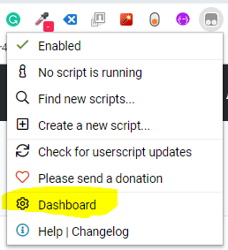
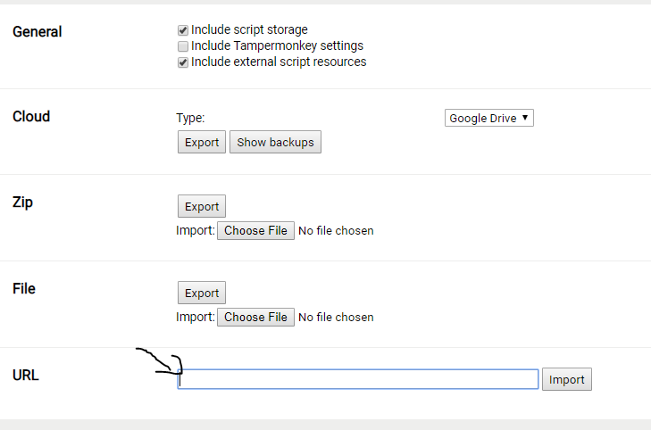
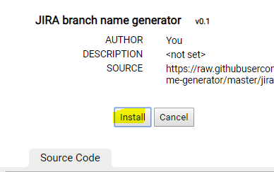

# jira-branch-name-generator
Tampermonkey script for creating branch name out of the jira id and name.

# Installaion
* Download Tampermonkey [here](https://chrome.google.com/webstore/detail/tampermonkey/dhdgffkkebhmkfjojejmpbldmpobfkfo?hl=en)
* once installed, open the app `Dashboard`

  

* click on `Utilities` on the top right hand side

  

* paste the raw url `https://raw.githubusercontent.com/avipunes/jira-branch-name-generator/master/jira-branch-name-generator.js` at the import from URL section

  
  
* and click `Install`

  
  
* go to jira story and you will see the `Create branch name` button next to the jira id

  

  

now the the branch name is in your clipboard: `PAP-252-some-story-name`
